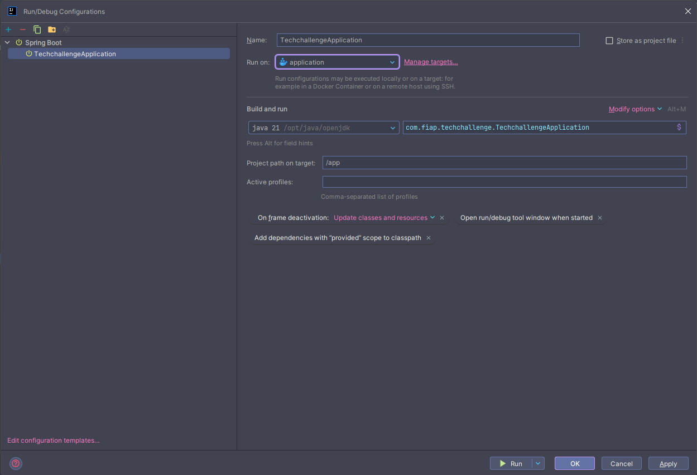
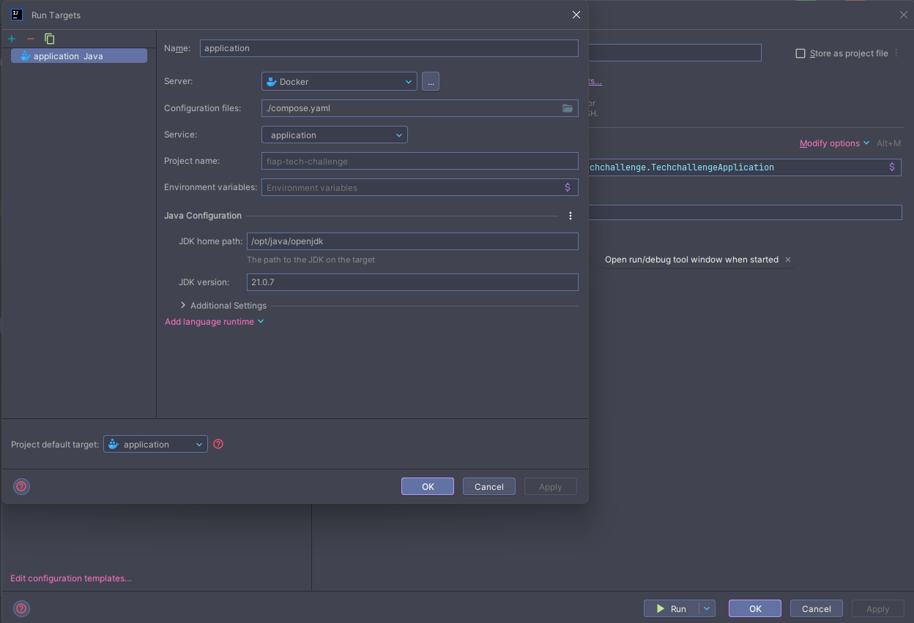
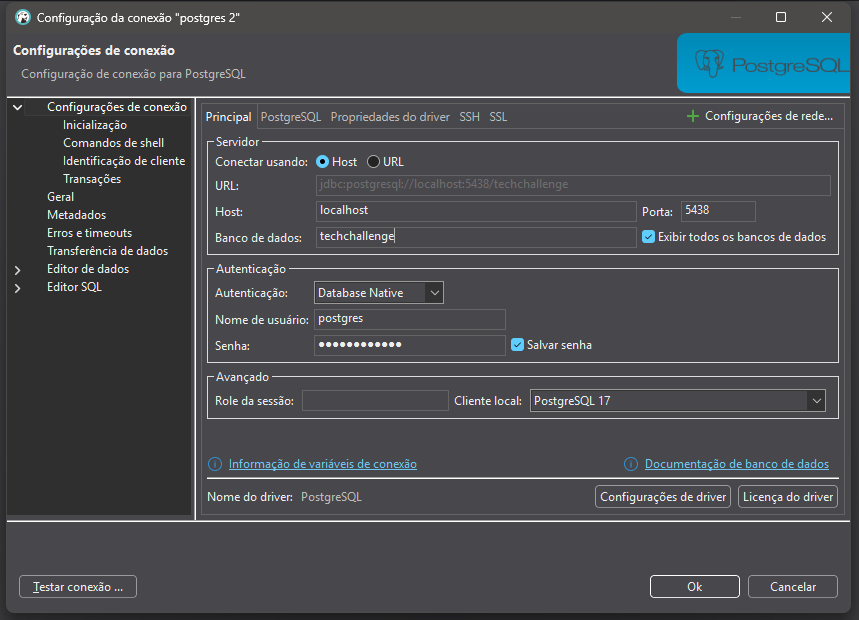

# 📦 TechChallenge - Manual de Execução com Docker

Este projeto utiliza Docker e Docker Compose para facilitar a execução do ambiente de desenvolvimento. Siga este passo a passo para clonar, configurar e executar corretamente.

---

## ✅ Pré-requisitos

Antes de começar, certifique-se de ter as seguintes ferramentas instaladas:

- [Docker](https://www.docker.com/get-started) (Engine + Compose)
- [IntelliJ IDEA](https://www.jetbrains.com/idea/)
- [Java JDK 21](https://www.oracle.com/java/technologies/javase/jdk21-archive-downloads.html)

---

## 📥 1. Clone o repositório

```bash
git clone https://github.com/fiap-tech-challenge-java/fiap-tech-challenge
cd fiap-tech-challenge
```

## 🐳 2. Suba os containers com Docker Compose

```bash
docker compose up --build
```
- Isso irá baixar as imagens necessárias, compilar o projeto e iniciar os serviços.

## 🛠️ 3. Configuração do IntelliJ IDEA

1. Abra o IntelliJ IDEA.
2. Selecione "Open" e escolha a pasta do projeto clonado.
3. Aguarde o IntelliJ carregar as dependências do Maven.
4. Certifique-se de que o JDK 21 está configurado:
   - Vá em `File` > `Project Structure` > `Project`.
   - Selecione `Java 21` como SDK.
   - Clique em `Apply` e depois em `OK`.
   - Se necessário, adicione o JDK 21:
     - Vá em `File` > `Project Structure` > `SDKs`.
     - Clique no ícone `+` e selecione `JDK`.
     - Navegue até o diretório onde o JDK 21 está instalado.
     - Clique em `OK` para adicionar o JDK.
5. Vá em Run > Edit Configurations. 
   - Clique no ícone `+` e selecione `Spring Boot`.
   - Nome do projeto: `TechChallengeApplication`.

   - Na parte do Run: acesse o `Manage targets`.
   - Selecione o `Docker Compose` e selecione o `compose.yaml` do projeto.
   - Selecione o service: `application`.
   - O java e jdk já estão configurados, então não é necessário alterar nada. (tem que aparecer o java 21).
   - Clique em `OK` para salvar a configuração.

6. Execute a aplicação:
   - Vá em `Run` > `Run 'TechChallengeApplication'`.
   - Aguarde até que a aplicação esteja rodando (você verá mensagens no console indicando que o servidor está ativo).
7. Acesse o banco de dados postgres:
   - Use o cliente de banco de dados integrado do IntelliJ ou qualquer outro cliente SQL.
   - Conecte-se ao banco de dados usando as seguintes credenciais:
     - Host: `localhost`
     - Porta: `5438`
     - Usuário: `postgres`
     - Senha: `postgrespass`
     - Banco de dados: `techchallenge`

8. Verifique se a aplicação está rodando corretamente acessando o endpoint:
   - Abra um navegador e acesse `http://localhost:8080/api/health`.
   - Você deve ver uma resposta indicando que a aplicação está funcionando.
   - Exemplo de resposta esperada:
     - ```bash 
       {
           "status": "UP",
           "version": "0.0.1",
           "database": "OK"
       }
       ```